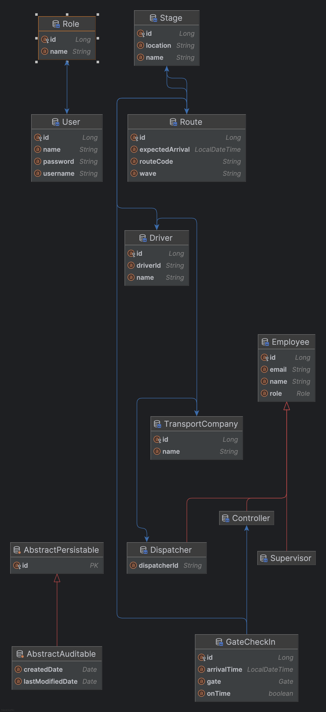

# 🚛 Logistics Management System (Spring Boot + MySQL + JPA + Security)

A logistics route tracking system built with **Spring Boot**, **Spring Security (JWT)**, **MySQL**, and **JPA (Hibernate)**.  
This application manages transport companies, routes, drivers, dispatchers, gate check-ins, and stage progression.

---

## ✨ Features

✅ Manage Drivers, Dispatchers, Companies, Stages, and Routes  
✅ Secure authentication using **JWT tokens**  
✅ Role-based authorization (`ROLE_USER`, `ROLE_ADMIN`, `ROLE_DISPATCHER`, `ROLE_CONTROLLER`, etc.)  
✅ API access controlled via *Spring Security + Filters*  
✅ Automatic demo data insertion using `DataLoader`  
✅ HATEOAS-friendly REST endpoints  
✅ Clean domain structure using JPA entities & relationships

---

## 🗂️ Domain Model

### Core Entities:
| Entity | Description |
|--------|-------------|
| **TransportCompany** | Represents a logistics partner or trucking vendor |
| **Driver** | Associated with a company, drives assigned routes |
| **Dispatcher** | Works for a company, assigns drivers/routes |
| **Stage** | Physical checkpoint location (e.g., A01, B43) |
| **Route** | Represents a delivery route with schedule & assigned driver |
| **GateCheckIn** | Timestamp + gate + controller verification |
| **Employee (Supervisor / Controller / Dispatcher)** | Uses `@Inheritance(strategy = SINGLE_TABLE)` |

---
## Class Diagram


## 🔐 Authentication / Authorization

### Authentication:
- Users log in through `/api/login`
- Returns JWT token in response header


### Authorization:
| Role | Permissions |
|------|-------------|
| `ROLE_ADMIN` | Create users / roles / update configurations |
| `ROLE_USER` | Read-only access to allowed endpoints |
| `ROLE_DISPATCHER` | Assign routes, manage driver activities |
| `ROLE_CONTROLLER` | Perform gate check-ins |

> Implemented via `.hasAuthority("ROLE_ADMIN")` in `SecurityConfig`.

---

## 🛠️ Tech Stack

| Layer | Technology |
|--------|------------|
| Backend | Java 17+, Spring Boot 3, Spring MVC |
| Security | Spring Security + JWT |
| Database | MySQL + Spring Data JPA |
| Build | Maven |
| Testing | Postman / IntelliJ HTTP Client |

---

## 🚀 How to run locally

---

### 1️⃣ Clone the repo

```bash

git clone https://github.com/<your-username>/logisticsmgmt.git
cd logisticsmgmt

```
### 2️⃣ Configure the database

Edit the /target/classes/application.properties file

spring:
  datasource:
    url: jdbc:mysql://localhost:3306/logisticsdb
    username: root
    password: yourpassword
  jpa:
    hibernate:
      ddl-auto: update
    show-sql: true

### 3️⃣ Run the App 
    mvn spring-boot:run


